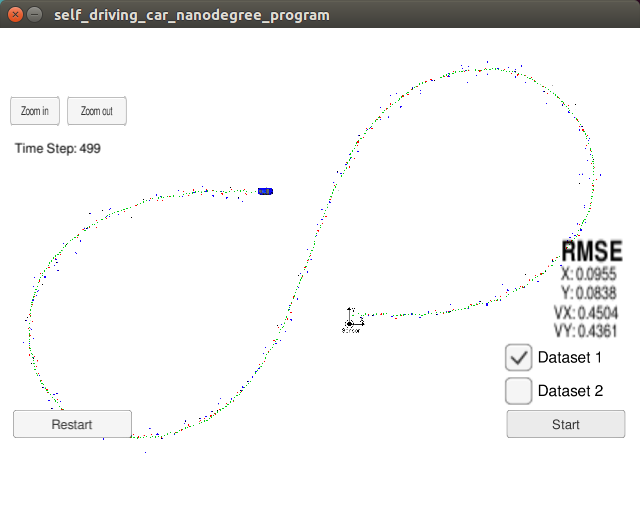

# Object Tracking with Sensor Fusion (Extended-Kalman-Filter)

## Table Content: ##
- [Objective](#objective)
- [Results](#results)
- [How to run](#howto)
- [Code Flow](#codeflow)

## Objective: 

	Utilize sensor data from both LIDAR and RADAR measurements for object (e.g. pedestrian, vehicles, 
	or other moving objects) tracking with the Extended Kalman Filter.

## Results: 

- Dataset 1

- Dataset 2

- Demonstration

Red circles are lidar measurements.

Blue circles are radar measurements (position markers inferred from radius and angle; the also-supplied radial velocity measurements are not shown).

Green markers are the car's position as estimated by the Kalman filter. It's clear that the Kalman filter does a good job of tracking the car's position with significantly reduced noise.

## How to run: 

1. Make a build directory: mkdir build && cd build
2. Compile: cmake .. && make
3. Run it: ./ExtendedKF
4. <a href="https://github.com/udacity/self-driving-car-sim/releases/">Download & Install Term 2 Simulator</a> Following the instruction from the repository
5. Start The Term Simulator, choose Project 1, and then Click <b>Start</b>

## Code Flow: <a name="codeflow">
The code cordination happens in main.cpp then wait for Simulator to start once the connections is established
then it starts the process flow: main.cpp calls FusionEFK.cpp to make initilization, update, 
and predictions and update and prediction logic are implemented in kalman_filter.cpp. tools.cpp has an implementation 
of RMSE and Jacobian matrix. 

I added a simple function to `tools.cpp` file that is called `RadarCartesianToPolar` and it converts radar measurements from cartesian coordinates to polar coordinates

## Conclusion: 
Using some simple calculations we can estimate the car position in a specific moment, of course using the Kalman Filter, which does it's job very good.
